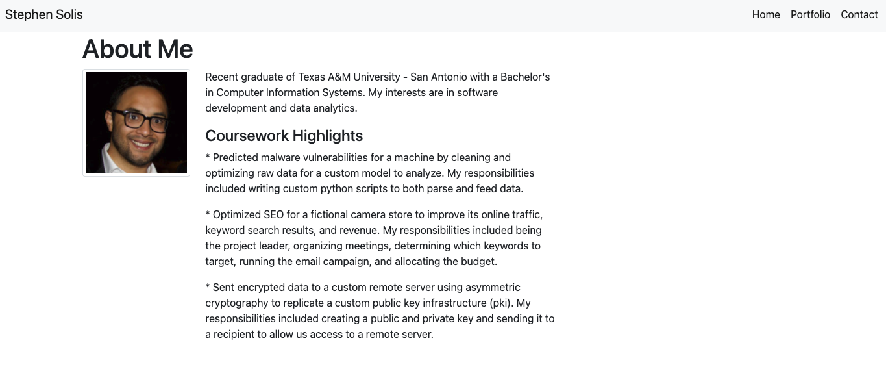
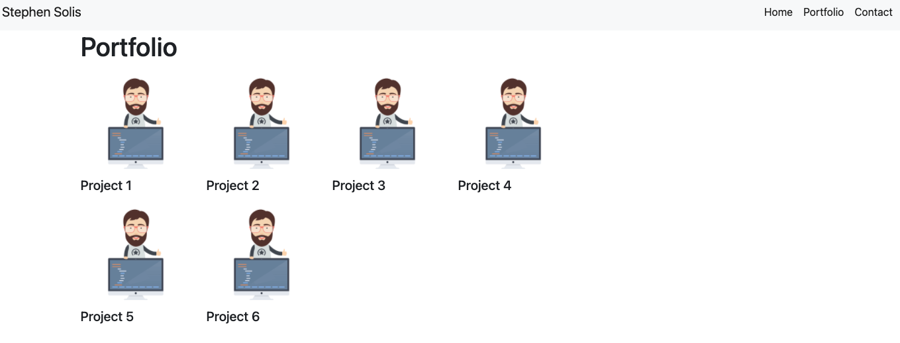
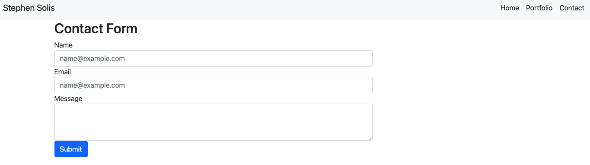

# Portfolio [(Project #2)]

## Description

Portoflio.com is a web application to inform the user about Stephen Solis, a current full stack developer bootcamp student.  

Supported Languages

English

## Technology Stack

### Frontend

- HTML 
- CSS
- Bootstrap

### Backend

- Bootstrap

# Phase 1

## Division of Labor

* Stephen
    *devops / bootstrap
    *frontend design and development using Bootstrap
    
## User Interface

Landing Page

Portolio Page

Contact Page

### Testing
Unit and Integration tests 01/12/21

## Challenges
The main challenge with completing this assignment was simply coming familiar with the syntax and searching for the correct Bootstrap syntax in order to impliment required design elements.  The overall activity was not too difficult.